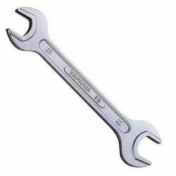
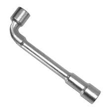

# 1"= 25.4 mm

    25.4/8= 3.175 সুতা

    3.175*4= 12.7 [12 থেকে ১৩ open spanner লাগবে]

## 13 নাপ নৌকার হিসাব

১০০ ফুট থেকে ৮ ঘনফুট বাতিল[ ৮% বাতিল]

    

## open Spanner 12mm and 13mm
## open Spanner 20mm and 22mm for need

(১) পাম্প এবং ম্যাশিনের সাইটকবার খুলা যা

<!--[profile](./w.jpeg)-->

## Ring Spanner 12 mm and 13 mm 

<!--[profile](./w.jpg)-->

## L-type wrench 13 mm 

<!--[profile](./r3.jpg)-->

